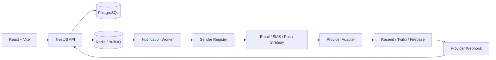

<div align="center">

# 🔔 Notifications Platform

### Full-stack notification delivery platform

Create, queue, send and track **Email**, **SMS** and **Web Push** notifications through interchangeable providers.

[](https://github.com/RoCalderon1405/Take_home_challenge_Notifications/actions/workflows/main.yml)
[](https://coveralls.io/github/RoCalderon1405/Take_home_challenge_Notifications?branch=main)


**[🌐 Live App](https://notifications-frontend.onrender.com/)**
&nbsp;•&nbsp;
**[📘 Swagger](https://notifications-api-karp.onrender.com/api/docs)**
&nbsp;•&nbsp;
**[📚 Compodoc](https://backend-documentation-fmou.onrender.com/)**
&nbsp;•&nbsp;
**[📊 Coverage](https://coveralls.io/github/RoCalderon1405/Take_home_challenge_Notifications?branch=main)**

<br />


</div>

---

## Overview

**Notifications Platform** is a full-stack notification management system built to create, process, send and track notifications through multiple delivery channels.

The backend persists notifications in PostgreSQL, queues delivery work with **BullMQ + Redis**, resolves the correct channel strategy, delegates delivery to the configured provider and tracks provider responses and webhook events.

| Area               | Implementation                                                     |
| ------------------ | ------------------------------------------------------------------ |
| **Frontend**       | React, Vite, TypeScript, Material UI, React Router, Redux, i18n    |
| **Backend**        | NestJS, TypeScript, Prisma                                         |
| **Database**       | PostgreSQL                                                         |
| **Queue / Cache**  | Redis + BullMQ                                                     |
| **Email**          | Console / Resend                                                   |
| **SMS**            | Console / Twilio                                                   |
| **Push**           | Console / Firebase Cloud Messaging                                 |
| **Authentication** | Email/password + JWT Bearer                                        |
| **API docs**       | Swagger / OpenAPI                                                  |
| **Code docs**      | Compodoc                                                           |
| **Deployment**     | Docker Compose + Render                                            |
| **Quality**        | ESLint, unit tests, E2E tests, GitHub Actions, CircleCI, Coveralls |

> [!NOTE]
> Google OAuth 2.0 is intentionally left as a **future improvement**. The current completed authentication flow uses email/password with JWT Bearer tokens.

---

## Live services

| Service                  | URL                                                                                                              |
| ------------------------ | ---------------------------------------------------------------------------------------------------------------- |
| 🌐 **Frontend**          | [Open application](https://notifications-frontend.onrender.com/)                                                 |
| ⚙️ **Backend API**       | [Open API](https://notifications-api-karp.onrender.com/)                                                         |
| 📘 **Swagger / OpenAPI** | [Open Swagger](https://notifications-api-karp.onrender.com/api/docs)                                             |
| 📚 **Compodoc**          | [Open backend documentation](https://backend-documentation-fmou.onrender.com/)                                   |
| 📊 **Coveralls**         | [Open coverage report](https://coveralls.io/github/RoCalderon1405/Take_home_challenge_Notifications?branch=main) |
| 💻 **Repository**        | [Open GitHub repository](https://github.com/RoCalderon1405/Take_home_challenge_Notifications)                    |

> [!IMPORTANT]
> The backend is hosted on a free Render instance. After a period of inactivity, the first request may take around a minute while the service wakes up.

---

## Architecture



The request lifecycle is intentionally decoupled from provider delivery:

```text
HTTP request
   ↓
Validation
   ↓
PostgreSQL persistence
   ↓
BullMQ job
   ↓
Worker
   ↓
Channel strategy
   ↓
Provider adapter
   ↓
Delivery tracking / webhook update
```

### Provider extensibility

```text
NotificationDispatcher
└── NotificationSenderRegistry
    ├── EmailSenderStrategy ──> EmailProvider ──> Console | Resend
    ├── SmsSenderStrategy   ──> SmsProvider   ──> Console | Twilio
    └── PushSenderStrategy  ──> PushProvider  ──> Console | Firebase
```

The orchestration layer depends on contracts rather than vendor SDKs. Adding another provider to an existing channel requires implementing the corresponding provider contract, registering it through NestJS dependency injection and adding its validated configuration.

---

## Features

| Feature                                         |        Status         |
| ----------------------------------------------- | :-------------------: |
| Email/password authentication                   |          ✅           |
| JWT Bearer authorization                        |          ✅           |
| Owner-scoped notifications                      |          ✅           |
| Create, update, delete and resend notifications |          ✅           |
| Search, filter and sort                         |          ✅           |
| Email delivery                                  |          ✅           |
| SMS delivery                                    |          ✅           |
| Browser Push delivery                           |          ✅           |
| Asynchronous processing with BullMQ             |          ✅           |
| Delivery attempts and provider references       |          ✅           |
| Resend webhook handling                         |          ✅           |
| Twilio webhook handling                         |          ✅           |
| Firebase Cloud Messaging                        |          ✅           |
| English / Spanish UI                            |          ✅           |
| Light / dark preferences                        |          ✅           |
| Swagger documentation                           |          ✅           |
| Compodoc documentation                          |          ✅           |
| Docker Compose development environment          |          ✅           |
| CI and coverage                                 |          ✅           |
| Google OAuth 2.0                                | ⏳ Future improvement |

---

## Run locally

### Requirements

- Docker Desktop with Linux containers, or Docker Engine with Docker Compose v2.
- Ports `3000`, `5173`, `5432` and `6379` available.
- Internet access for the initial image/dependency download.

No local PostgreSQL or Redis installation is required.

### 1. Clone the repository

```bash
git clone https://github.com/RoCalderon1405/Take_home_challenge_Notifications.git
cd Take_home_challenge_Notifications
```

### 2. Prepare environment variables

macOS / Linux:

```bash
cp .env.example .env
```

Windows PowerShell:

```powershell
Copy-Item .env.example .env
```

### 3. Start the complete stack

```bash
docker compose up --build --wait
```

Or use the included helpers.

Windows:

```powershell
powershell -ExecutionPolicy Bypass -File .\start.ps1
```

macOS / Linux:

```bash
bash ./start.sh
```

### 4. Open the local services

| Service    | Local address                    |
| ---------- | -------------------------------- |
| Frontend   | `http://localhost:5173`          |
| Backend    | `http://localhost:3000/api`      |
| Swagger    | `http://localhost:3000/api/docs` |
| PostgreSQL | `localhost:5432`                 |
| Redis      | `localhost:6379`                 |

### Demo account

```text
Email:    demo@notifications.local
Password: Demo1234!
```

The local seed creates this account and sample data for evaluation.

---

## Notification providers

The default local environment uses **console providers**, which lets the complete application flow run without external credentials or real messages.

| Channel | Local default | Real integration         |
| ------- | ------------- | ------------------------ |
| Email   | Console       | Resend                   |
| SMS     | Console       | Twilio                   |
| Push    | Console       | Firebase Cloud Messaging |

External provider credentials belong in environment variables and must never be committed to Git.

---

## Development commands

### Docker

```bash
docker compose ps
docker compose logs -f backend frontend
docker compose up -d --wait
docker compose down
```

Development watch mode:

```bash
docker compose up --build --watch
```

Rebuild services after dependency or configuration changes:

```bash
docker compose up -d --build --force-recreate --wait
```

### Backend

```bash
cd backend_notifications
npm ci
npm run lint
npm test
npm run test:e2e
npm run build
```

Generate and inspect Compodoc locally:

```bash
npm run docs
npm run docs:serve
```

### Frontend

```bash
cd frontend_notifications
npm ci
npm run lint
npm test
npm run build
```

---

## Repository structure

```text
.
├── backend_notifications/
│   ├── src/
│   ├── prisma/
│   └── README.md
├── frontend_notifications/
│   ├── public/
│   ├── src/
│   └── README.md
├── docs/
│   └── compodoc-render.md
├── docker-compose.yml
├── start.ps1
├── start.sh
└── README.md
```

---

## Documentation

| Resource                                                           | Description                                                           |
| ------------------------------------------------------------------ | --------------------------------------------------------------------- |
| [⚛️ Frontend guide](frontend_notifications/README.md)              | Frontend structure, API integration, state, i18n, Push and deployment |
| [🛡️ Backend guide](backend_notifications/README.md)                | Modules, Prisma, queues, providers, webhooks, tests and deployment    |
| [📘 Swagger](https://notifications-api-karp.onrender.com/api/docs) | Interactive REST API documentation                                    |
| [📚 Compodoc](https://backend-documentation-fmou.onrender.com/)    | Backend source-code documentation                                     |
| [📄 Compodoc deployment guide](docs/compodoc-render.md)            | How the static documentation is generated and deployed                |

---

## Quality and delivery

| CI / Quality                                           | Deployment                                    |
| ------------------------------------------------------ | --------------------------------------------- |
| GitHub Actions validates the project.                  | Render hosts the frontend and backend.        |
| CircleCI validates the backend and publishes coverage. | Compodoc is deployed as a Render Static Site. |
| Coveralls tracks backend test coverage.                | Secrets remain outside the repository.        |

---

## Future improvements

- Complete Google OAuth 2.0 using the existing Bearer-token architecture.
- Expand frontend automated test coverage.
- Add more notification providers without changing the notification lifecycle.
- Add deeper observability and operational metrics.

---

## Author

**Roberto Tonatiuh Calderon Aguilar**  
Full Stack Developer

[GitHub](https://github.com/RoCalderon1405) ·
[Portfolio](https://portfoliorocalderon.netlify.app/#experience) ·
[Repository](https://github.com/RoCalderon1405/Take_home_challenge_Notifications)
